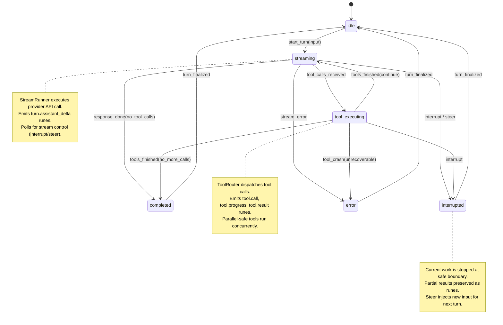
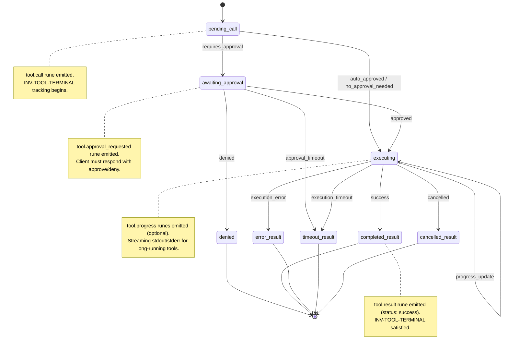
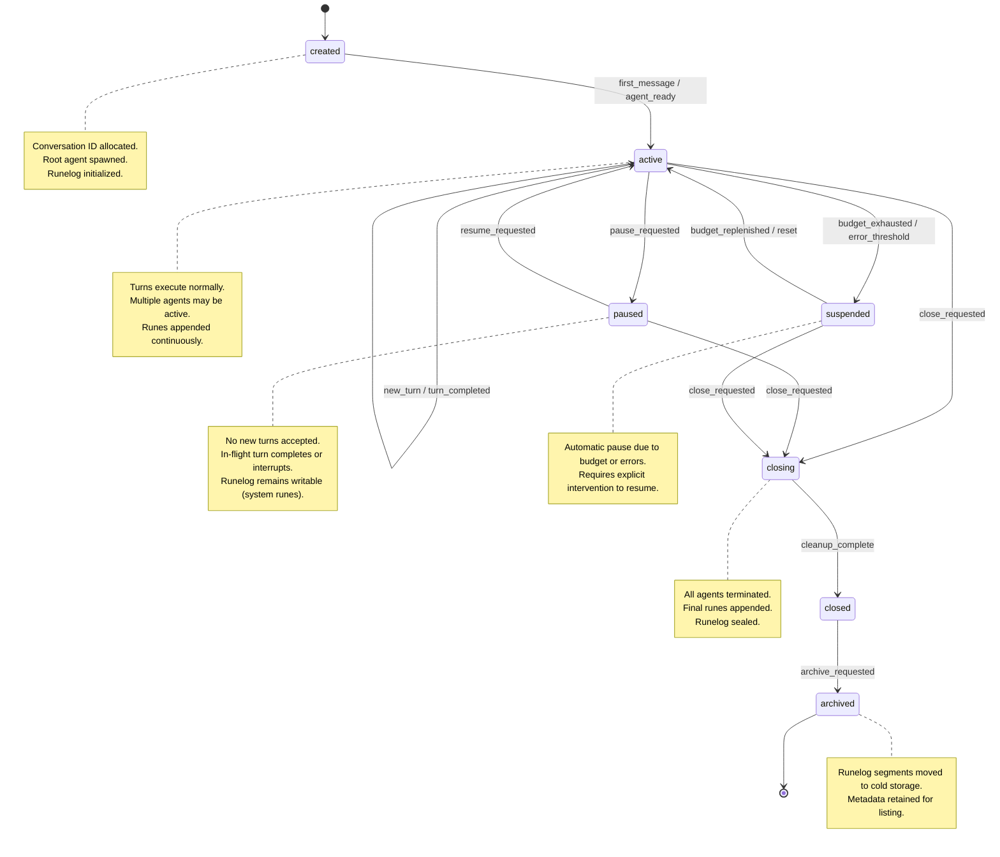
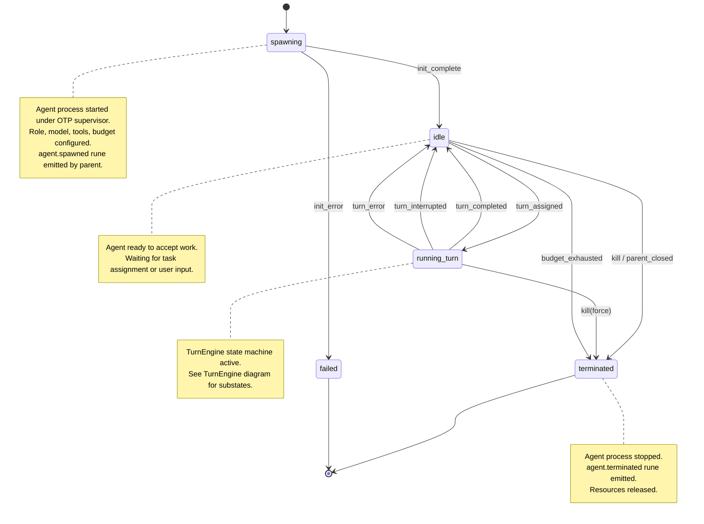
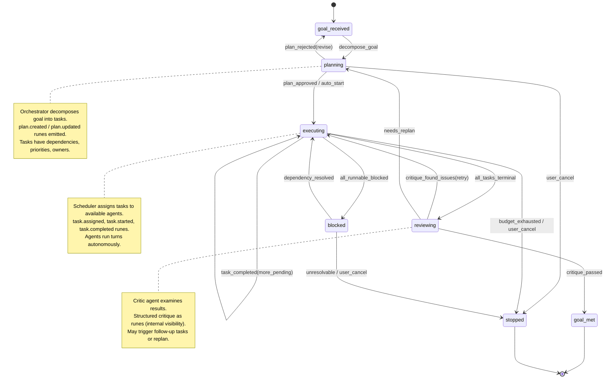

# ECHS 2.0 State Machines

Formal state machine definitions for core ECHS 2.0 subsystems. All
diagrams use Mermaid syntax and render on GitHub.

---

## TurnEngine State Machine

Governs the lifecycle of a single turn within an agent.

### Turn Events (Rune Kinds)

| Transition | Rune Kind | Payload |
|---|---|---|
| idle -> streaming | `turn.started` | turn_id, agent_id, input |
| streaming (delta) | `turn.assistant_delta` | content fragment |
| streaming -> tool_executing | `turn.tool_calls_received` | [call_ids] |
| streaming -> completed | `turn.completed` | final_output, usage |
| streaming -> interrupted | `turn.interrupted` | reason, partial_output |
| streaming -> error | `turn.error` | error_type, message |
| tool_executing -> streaming | `turn.tools_finished` | [result summaries] |
| completed -> idle | (internal, no rune) | |
| error -> idle | (internal, no rune) | |

---

## Tool Lifecycle State Machine

Governs a single tool invocation from call to terminal result.

### Tool Events (Rune Kinds)

| State | Rune Kind | Payload |
|---|---|---|
| pending_call | `tool.call` | call_id, tool_name, arguments |
| awaiting_approval | `tool.approval_requested` | call_id, policy_reason |
| approved | `tool.approved` | call_id, approver |
| denied | `tool.denied` | call_id, reason |
| executing (progress) | `tool.progress` | call_id, stdout/stderr chunk |
| completed_result | `tool.result` | call_id, status=success, output |
| error_result | `tool.result` | call_id, status=error, error |
| timeout_result | `tool.result` | call_id, status=timeout |
| cancelled_result | `tool.result` | call_id, status=cancelled |

### Invariants Enforced
- **INV-TOOL-TERMINAL:** Every `tool.call` gets exactly one `tool.result`
- **INV-TOOL-CALL-BEFORE-RESULT:** No `tool.result` without prior `tool.call`
- **INV-TOOL-APPROVAL-BEFORE-EXEC:** Execution blocked until approval when required

---

## Session (Conversation) Lifecycle State Machine

Governs the lifecycle of a conversation from creation to archival.

### Session Events (Rune Kinds)

| Transition | Rune Kind | Payload |
|---|---|---|
| [*] -> created | `session.created` | conversation_id, config |
| created -> active | `session.activated` | root_agent_id |
| active -> paused | `session.paused` | reason |
| paused -> active | `session.resumed` | |
| active -> suspended | `session.suspended` | reason, budget_info |
| suspended -> active | `session.unsuspended` | |
| * -> closing | `session.closing` | reason |
| closing -> closed | `session.closed` | final_stats |

---

## Agent Lifecycle State Machine

Governs the lifecycle of a single agent within a conversation.

### Agent Events (Rune Kinds)

| Transition | Rune Kind | Payload |
|---|---|---|
| [*] -> spawning | `agent.spawning` | agent_id, role, model, parent_id |
| spawning -> idle | `agent.ready` | agent_id |
| spawning -> failed | `agent.failed` | agent_id, error |
| idle -> running_turn | `turn.started` | (see TurnEngine) |
| running_turn -> idle | `turn.completed` | (see TurnEngine) |
| * -> terminated | `agent.terminated` | agent_id, reason, stats |

### Invariants Enforced
- **INV-AGENT-SUPERVISED:** OTP supervision, crash containment
- **INV-AGENT-BUDGET:** Budget tracking and enforcement
- **INV-TURN-SEQUENTIAL:** At most one turn active per agent

---

## Autonomy Loop State Machine

Governs the goal-directed planning and execution cycle (Phase 4).

### Autonomy Events (Rune Kinds)

| State | Rune Kind | Payload |
|---|---|---|
| goal_received | `plan.goal_received` | goal_description |
| planning | `plan.created` | plan_id, tasks |
| planning | `plan.updated` | plan_id, changes |
| executing | `plan.task_assigned` | task_id, agent_id |
| executing | `plan.task_started` | task_id |
| executing | `plan.task_completed` | task_id, result, evidence |
| reviewing | `plan.critique` | plan_id, findings |
| goal_met | `plan.goal_met` | plan_id, summary |
| stopped | `plan.stopped` | reason |
